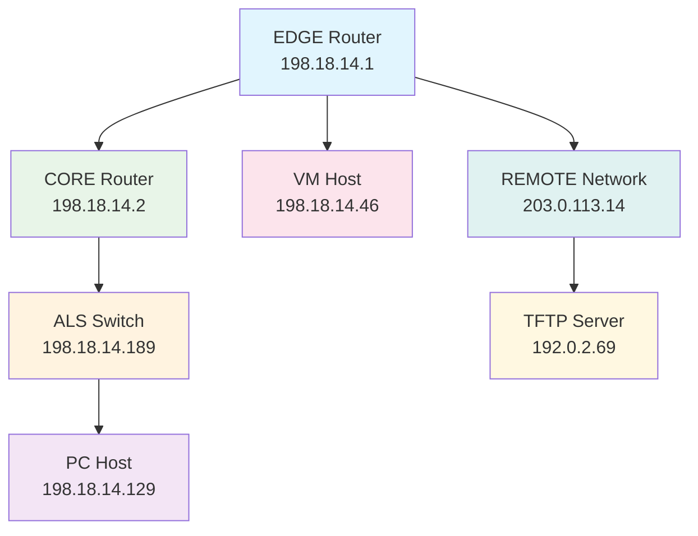
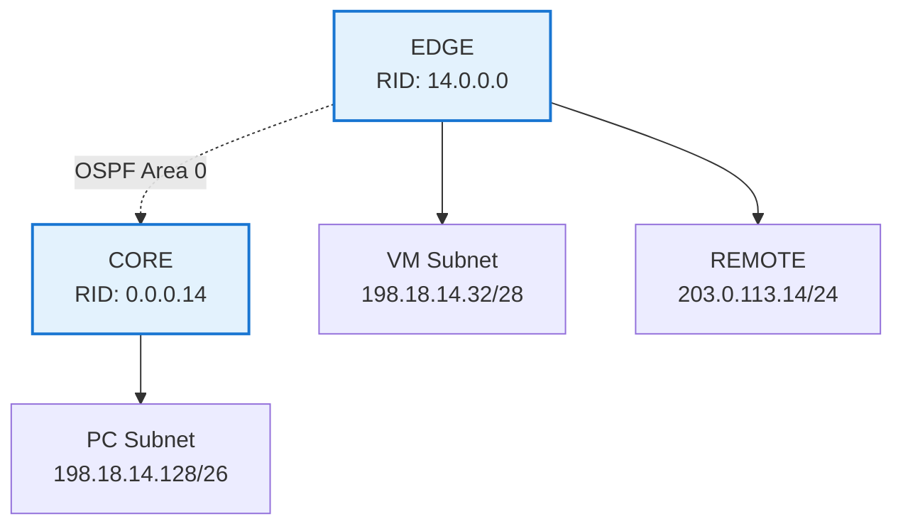
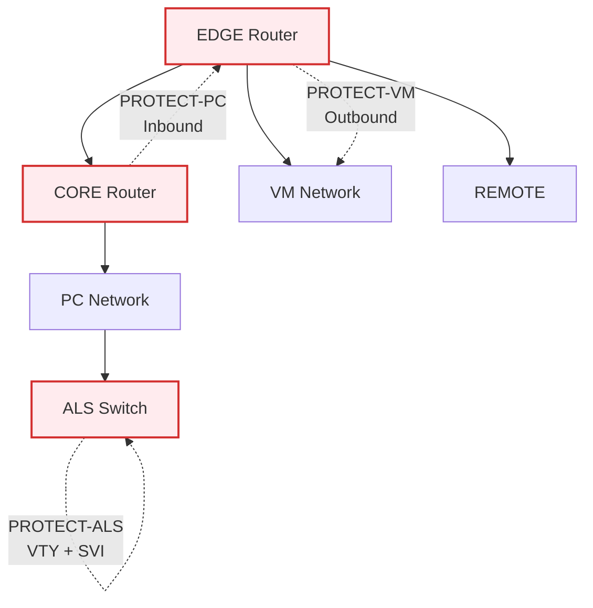
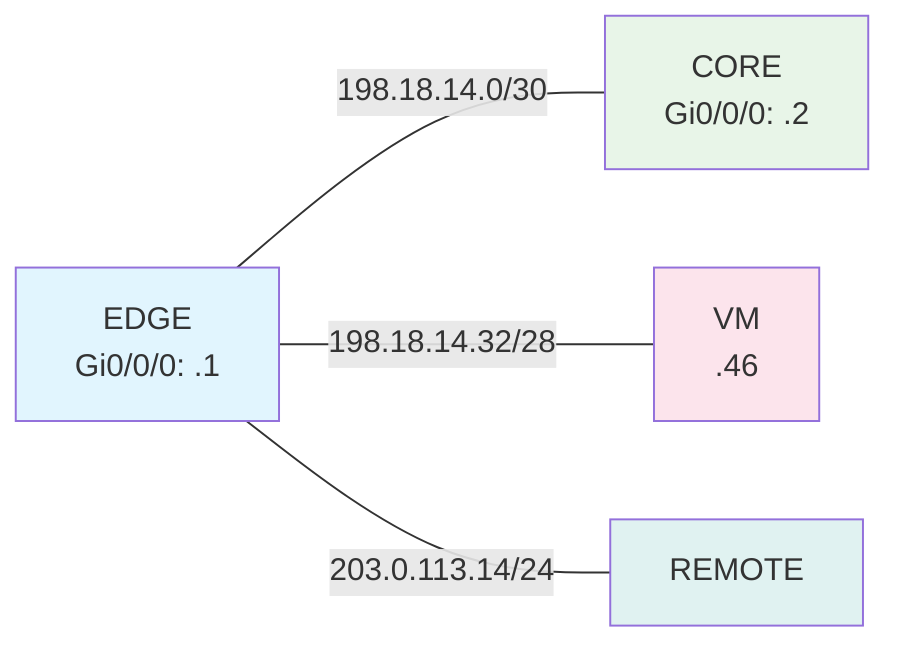
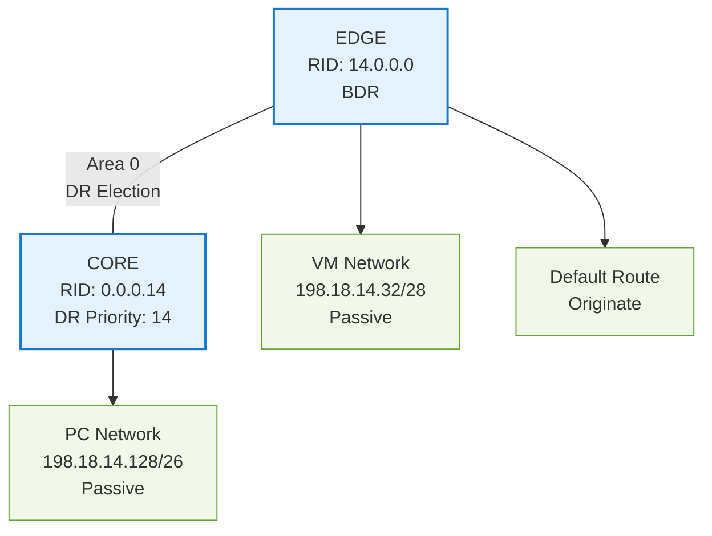
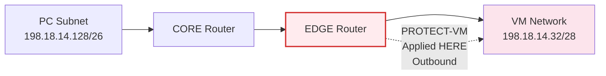
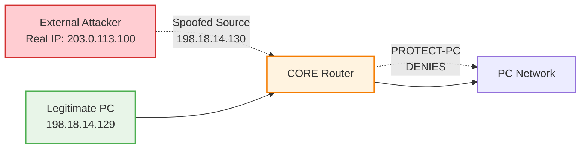
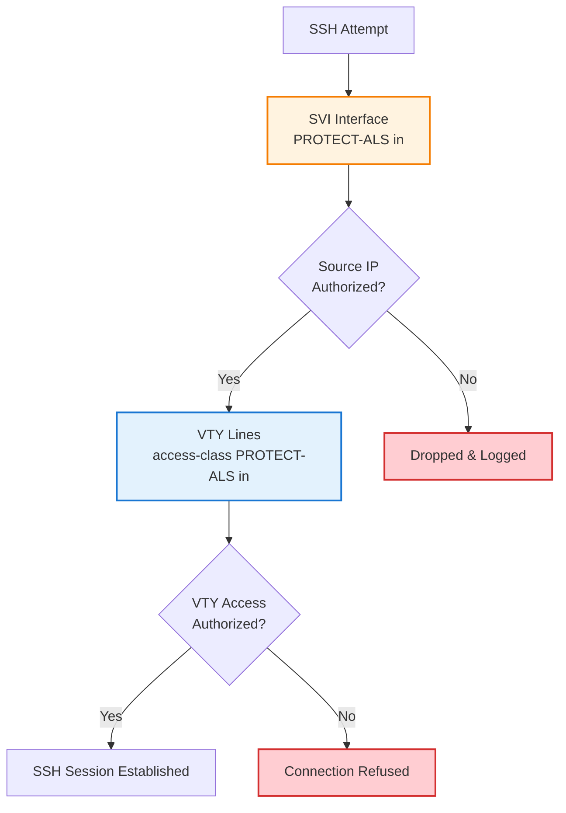

# Lab 09 - Securing Your Network with Standard ACLs
## Complete Learning Guide with Sequential Topology Building

> **Magic Number**: U = 14  
> **Username**: bouw0026  
> **Environment**: Windows 10 + PuTTY + Cisco Routers/Switches

---

## 🎯 Learning Objectives & Theoretical Foundation

By completing this lab, you will master:

### Core Networking Concepts
- **Standard ACL Theory**: Source-based filtering principles
- **ACL Placement Strategy**: "Close to destination" rule for standard ACLs
- **Network Segmentation**: Defense-in-depth security architecture
- **OSPF Integration**: How routing protocols interact with security policies

### Practical Skills
- Named vs numbered ACL configuration
- ACL logging and hit-counter analysis
- VTY line protection with access-class
- Anti-spoofing implementation techniques

### Security Principles
- **Principle of Least Privilege**: Only necessary access granted
- **Defense in Depth**: Multiple security layers
- **Audit Trail**: Logging for security monitoring

---

## 🗺️ Network Topology Evolution

### Phase 1: Basic Infrastructure


### Phase 2: OSPF Routing Domain


### Phase 3: Security Policies Applied


---

## 📋 Network Addressing Reference

| Device | Interface | IP Address | Subnet | Purpose |
|--------|-----------|------------|---------|---------|
| **EDGE** | Gi0/0/0 | 198.18.14.1/30 | Transit | EDGE↔CORE |
| **CORE** | Gi0/0/0 | 198.18.14.2/30 | Transit | CORE↔EDGE |
| **EDGE** | Gi0/0/2 | 198.18.14.33/28 | VM | VM Gateway |
| **VM** | Gi0/0 | 198.18.14.46/28 | VM | VM Host |
| **CORE** | Gi0/0/1 | 198.18.14.190/26 | PC | PC Gateway |
| **PC** | Gi0/0 | 198.18.14.129/26 | PC | PC Host |
| **ALS** | VLAN1 | 198.18.14.189/26 | PC | Switch Mgmt |
| **EDGE** | Gi0/0/1 | 203.0.113.14/24 | REMOTE | External |
| **TFTP** | Gi0/0 | 192.0.2.69/24 | REMOTE | File Server |

### 🧮 Subnet Calculations Quick Reference
```
/30 = 255.255.255.252 = Wildcard 0.0.0.3    (4 addresses)
/28 = 255.255.255.240 = Wildcard 0.0.0.15   (16 addresses)
/26 = 255.255.255.192 = Wildcard 0.0.0.63   (64 addresses)
/24 = 255.255.255.0   = Wildcard 0.0.0.255  (256 addresses)
```

---

## 🚀 Sequential Implementation Guide

### Step 0: Pre-Lab Preparation

#### Create Submission File
```bash
# On your Windows desktop
echo "Lab 09 - bouw0026" > 09-bouw0026.txt
```

#### PuTTY Connection Setup
1. **Session Configuration**:
   - Host Name: Router/Switch IP
   - Port: 22 (SSH) or 23 (Telnet)
   - Connection Type: SSH/Telnet

2. **Terminal Settings**:
   - Enable logging: Session → Logging → All session output
   - Buffer size: Window → Lines of scrollback: 2000

---

### Step 1: Basic Device Configuration

#### 🎯 Checkpoint 1: Device Identity & Access

**Theoretical Foundation:**
> Device hardening begins with proper identification, privilege separation, and secure remote access. This establishes the foundation for all subsequent security policies.

```bash
# EDGE Router Configuration
enable
configure terminal
hostname bouw0026-EDGE
enable secret class
no ip domain-lookup
ip domain-name cnap.cst
username cisco privilege 15 secret cisco
crypto key generate rsa modulus 1024
ip ssh version 2
line vty 0 4
 transport input telnet ssh
 login local
exit
write memory
```

**Expected Output Example:**
```
bouw0026-EDGE(config)# crypto key generate rsa modulus 1024
The name for the keys will be: bouw0026-EDGE.cnap.cst
% The key modulus size is 1024 bits
% Generating 1024 bit RSA keys, keys will be non-exportable...
[OK] (elapsed time was 1 seconds)

bouw0026-EDGE(config)# 
```

**Verification Commands:**
```bash
show running-config | include hostname|username|crypto
show ip ssh
```

**📸 Screenshot Requirements:**
- Device prompt showing correct hostname
- SSH key generation success message
- Username configuration confirmation

---

### Step 2: Interface Addressing

#### 🎯 Checkpoint 2: Layer 3 Connectivity

**Theoretical Foundation:**
> Proper IP addressing is crucial for ACL effectiveness. Standard ACLs filter based on source IP addresses, so understanding subnet boundaries and wildcard masks is essential for policy implementation.

```bash
# EDGE Router Interfaces
interface Gi0/0/0
 description EDGE-to-CORE
 ip address 198.18.14.1 255.255.255.252
 no shutdown

interface Gi0/0/1
 description EDGE-to-REMOTE
 ip address 203.0.113.14 255.255.255.0
 no shutdown

interface Gi0/0/2
 description EDGE-to-VM
 ip address 198.18.14.33 255.255.255.240
 no shutdown
```

**Network Topology Progress:**


**Verification Commands:**
```bash
show ip interface brief
ping 198.18.14.2  # Test EDGE to CORE
```

**Expected Output Example:**
```
Interface              IP-Address      OK? Method Status                Protocol
GigabitEthernet0/0/0   198.18.14.1     YES manual up                    up      
GigabitEthernet0/0/1   203.0.113.14    YES manual up                    up      
GigabitEthernet0/0/2   198.18.14.33    YES manual up                    up      
```

---

### Step 3: OSPF Routing Configuration

#### 🎯 Checkpoint 3: Dynamic Routing

**Theoretical Foundation:**
> OSPF provides the routing foundation that ACLs will filter. Understanding OSPF areas, router-IDs, and passive interfaces is crucial because ACLs can inadvertently block OSPF hello packets if misplaced.

```bash
# EDGE Router OSPF
router ospf 14
 router-id 14.0.0.0
 network 198.18.14.0 0.0.0.3 area 0
 network 198.18.14.32 0.0.0.15 area 0
 network 203.0.113.14 0.0.0.255 area 0
 passive-interface default
 no passive-interface Gi0/0/0
 no passive-interface Gi0/0/2
 default-information originate
exit

# CORE Router OSPF
router ospf 14
 router-id 0.0.0.14
 network 198.18.14.0 0.0.0.3 area 0
 network 198.18.14.128 0.0.0.63 area 0
 passive-interface default
 no passive-interface Gi0/0/0
 no passive-interface Gi0/0/1
exit
```

**OSPF Topology Visualization:**


**Verification Commands:**
```bash
show ip ospf neighbor
show ip ospf interface Gi0/0/0
show ip route ospf
```

**Expected Output Example:**
```
Neighbor ID     Pri   State           Dead Time   Address         Interface
0.0.0.14         14   FULL/DR         00:00:39    198.18.14.2     GigabitEthernet0/0/0
```

---

## 🔒 Security Policy Implementation

### Policy 1: PROTECT-VM (VM Network Protection)

#### 🎯 Checkpoint 4: Standard ACL Near Destination

**Theoretical Foundation:**
> **Standard ACL Placement Rule**: Place standard ACLs as close to the destination as possible. This minimizes the impact on other network traffic while providing granular control over access to protected resources.

**Security Policy Statement:**
> Only hosts in the PC subnet (198.18.14.128/26) may initiate traffic to the VM network (198.18.14.32/28). All other sources shall be denied and logged.

**ACL Placement Analysis:**


**Configuration:**
```bash
# On EDGE Router
ip access-list standard PROTECT-VM
 permit 198.18.14.128 0.0.0.63 log
 deny any log
exit

interface Gi0/0/2
 ip access-group PROTECT-VM out
 logging access-list
exit
```

**Wildcard Mask Calculation:**
```
PC Subnet: 198.18.14.128/26
Subnet Mask: 255.255.255.192
Wildcard: 0.0.0.63 (inverse of subnet mask)

Binary Analysis:
Network:  11000110.00010010.00001110.10000000
Wildcard: 00000000.00000000.00000000.00111111
Result:   Matches 198.18.14.128 through 198.18.14.191
```

**Testing Procedures:**
```bash
# Clear counters before testing
clear access-list counters PROTECT-VM

# Test 1: PC to VM (Should PASS)
PC# ping 198.18.14.46

# Test 2: CORE to VM (Should FAIL)
CORE# ping 198.18.14.46

# Test 3: CORE with PC source (Should PASS)
CORE# ping 198.18.14.46 source 198.18.14.190
```

**Expected Test Results:**
```
# Test 1 - Success
Type escape sequence to abort.
Sending 5, 100-byte ICMP Echos to 198.18.14.46, timeout is 2 seconds:
!!!!!
Success rate is 100 percent (5/5), round-trip min/avg/max = 1/2/4 ms

# Test 2 - Failure
Type escape sequence to abort.
Sending 5, 100-byte ICMP Echos to 198.18.14.46, timeout is 2 seconds:
.....
Success rate is 0 percent (0/5)
```

**Verification Commands:**
```bash
show ip access-lists PROTECT-VM
show ip interface Gi0/0/2 | include PROTECT-VM
show logging | include PROTECT-VM
```

**Expected Verification Output:**
```
Standard IP access list PROTECT-VM
    10 permit 198.18.14.128, wildcard bits 0.0.0.63 log (5 matches)
    20 deny   any log (5 matches)
```

---

### Policy 2: PROTECT-PC (Anti-Spoofing Protection)

#### 🎯 Checkpoint 5: Anti-Spoofing Implementation

**Theoretical Foundation:**
> **IP Spoofing Prevention**: Attackers often forge source IP addresses to bypass security controls. Anti-spoofing ACLs prevent packets with internal source addresses from entering through external interfaces.

**Security Policy Statement:**
> Prevent any packet whose source IP claims to be within the PC subnet (198.18.14.128/26) but does not originate from the trusted PC segment. All other traffic shall be permitted.

**Anti-Spoofing Concept:**


**Configuration:**
```bash
# Create spoof test interface on EDGE
interface Loopback130
 ip address 198.18.14.130 255.255.255.255
exit

# On CORE Router
ip access-list standard PROTECT-PC
 deny 198.18.14.128 0.0.0.63 log
 permit any log
exit

interface Gi0/0/0
 ip access-group PROTECT-PC in
 logging access-list
exit
```

**Testing Procedures:**
```bash
# Clear counters
clear access-list counters PROTECT-PC

# Test 1: Legitimate external traffic (Should PASS)
EDGE# ping 198.18.14.129 source 203.0.113.14

# Test 2: Spoofed internal address (Should FAIL)
EDGE# ping 198.18.14.129 source 198.18.14.130

# Test 3: PC to CORE (Should PASS)
PC# ping 198.18.14.190
```

**Expected Results Analysis:**
- **Test 1**: External source (203.0.113.14) → Permitted by "permit any"
- **Test 2**: Spoofed internal source (198.18.14.130) → Denied by first ACE
- **Test 3**: Legitimate PC traffic → Not filtered (different path)

---

### Policy 3: PROTECT-ALS (Management Plane Security)

#### 🎯 Checkpoint 6: VTY Line Protection

**Theoretical Foundation:**
> **Management Plane Hardening**: Network devices are high-value targets. Restricting administrative access to authorized sources and protocols reduces attack surface and provides audit trails.

**Security Policy Statement:**
> Only hosts in the PC subnet (198.18.14.128/26) and the TFTP server (192.0.2.69) may establish SSH sessions to the switch management interface. All other attempts shall be denied and logged.

**Dual-Layer Protection:**


**Configuration:**
```bash
# On ALS Switch
ip access-list standard PROTECT-ALS
 permit 198.18.14.128 0.0.0.63
 permit host 192.0.2.69
 deny any log
exit

# Apply to management interface
interface Vlan1
 ip access-group PROTECT-ALS in
exit

# Apply to VTY lines
line vty 0 4
 access-class PROTECT-ALS in
exit
```

**Testing Procedures:**
```bash
# Test 1: PC SSH access (Should PASS)
PC# ssh admin@198.18.14.189

# Test 2: TFTP server access (Should PASS - requires instructor)
TFTP# ssh admin@198.18.14.189

# Test 3: VM SSH access (Should FAIL)
VM# ssh admin@198.18.14.189

# Test 4: Unauthorized source (Should FAIL)
CORE# ssh -l admin 198.18.14.189
```

---

## 📊 Comprehensive Verification & Documentation

### CO1 - Policy 1 Verification (PROTECT-VM)

**Commands to Execute:**
```bash
# Clear and test
EDGE# clear access-list counters PROTECT-VM
PC# ping 198.18.14.46
CORE# ping 198.18.14.46
CORE# ping 198.18.14.46 source 198.18.14.190

# Collect evidence
EDGE# show ip access-lists PROTECT-VM
EDGE# show ip interface Gi0/0/2 | include PROTECT-VM
EDGE# show logging | include PROTECT-VM
```

**Sample Documentation Format:**
```
=== CO1 – Policy #1 - PROTECT-VM Verification ===

bouw0026-EDGE# show ip access-lists PROTECT-VM
Standard IP access list PROTECT-VM
    10 permit 198.18.14.128, wildcard bits 0.0.0.63 log (6 matches)
    20 deny   any log (5 matches)

bouw0026-EDGE# show ip interface Gi0/0/2 | include PROTECT-VM
  Outgoing access list is PROTECT-VM

!-- PROTECT-VM successfully applied outbound on Gi0/0/2
!-- Permit counter shows PC access working (6 matches)
!-- Deny counter shows unauthorized access blocked (5 matches)
```

### CO2 - Policy 2 Verification (PROTECT-PC)

**Commands to Execute:**
```bash
CORE# clear access-list counters PROTECT-PC
PC# ping 198.18.14.190
EDGE# ping 198.18.14.129 source 198.18.14.130
EDGE# ping 198.18.14.129 source 203.0.113.14

CORE# show ip access-lists PROTECT-PC
CORE# show ip interface Gi0/0/0 | include PROTECT-PC
```

### CO3 - Policy 3 Verification (PROTECT-ALS)

**Commands to Execute:**
```bash
ALS# clear access-list counters PROTECT-ALS
PC# ssh admin@198.18.14.189
VM# ssh admin@198.18.14.189

ALS# show ip access-lists PROTECT-ALS
ALS# show ip interface Vlan1 | include PROTECT-ALS
ALS# show running-config | section line vty
```

---

## 🧠 Advanced Learning Exercises

### Exercise 1: ACL Editing Practice
```bash
# Add new permitted source to PROTECT-VM
ip access-list standard PROTECT-VM
 15 permit host 203.0.113.69 log
 show access-lists PROTECT-VM
```

### Exercise 2: Troubleshooting Scenario
**Problem**: "PC can't reach VM after ACL implementation"
**Troubleshooting Steps**:
1. Check ACL hit counters
2. Verify ACL placement and direction
3. Test with debug ip packet
4. Analyze logs

### Exercise 3: Security Policy Expansion
**Scenario**: Add DMZ network (198.18.14.64/28)
**Tasks**:
1. Design ACL to allow DMZ→VM but deny VM→DMZ
2. Implement anti-spoofing for DMZ subnet
3. Update PROTECT-ALS for DMZ management access

---

## 📚 Theoretical Knowledge Integration

### Chapter 7 Key Concepts Applied

1. **Standard vs Extended ACLs**
   - Standard: Source IP only (used in this lab)
   - Extended: Source, destination, protocol, ports

2. **ACL Processing Logic**
   - Top-down evaluation
   - First match wins
   - Implicit deny all at end

3. **Named ACL Advantages**
   - Descriptive names
   - Easier editing
   - Line number flexibility

4. **Wildcard Mask Mathematics**
   ```
   Subnet Mask:  255.255.255.192 (/26)
   Wildcard:     0.0.0.63
   Binary:       00000000.00000000.00000000.00111111
   Meaning:      Match any value in last 6 bits
   ```

### Security Best Practices Demonstrated

1. **Defense in Depth**: Multiple ACL policies protecting different network segments
2. **Principle of Least Privilege**: Only necessary access granted
3. **Logging and Monitoring**: All policies include logging for audit trails
4. **Management Plane Protection**: Separate controls for device access

---

## 🔧 Troubleshooting Guide

### Common Issues and Solutions

| Problem | Symptoms | Solution |
|---------|----------|----------|
| ACL not filtering | Traffic passes unexpectedly | Check interface and direction |
| No ACL hits | Counters remain at 0 | Verify traffic path and ACL placement |
| SSH fails after ACL | Connection refused | Check VTY access-class configuration |
| OSPF adjacency down | Neighbor state not FULL | Ensure ACL doesn't block OSPF hellos |

### Debug Commands
```bash
debug ip packet detail
debug ip access-list
show logging
show ip access-lists
```

---

## 📤 Final Submission Checklist

### File Preparation
```bash
# Create comprehensive submission file
copy running-config tftp://192.0.2.69/bouw0026-EDGE.cfg
copy running-config tftp://192.0.2.69/bouw0026-CORE.cfg
copy running-config tftp://192.0.2.69/bouw0026-ALS.cfg

# Submit verification document
copy 09-bouw0026.txt tftp://192.0.2.69/
```

### Verification
```bash
# Confirm submission
ssh cisco@192.0.2.69
ls -l /var/tftp/*bouw0026*
```

### Required Documentation Sections
- [ ] CO1: PROTECT-VM verification with hit counters
- [ ] CO2: PROTECT-PC anti-spoofing demonstration
- [ ] CO3: PROTECT-ALS management plane security
- [ ] All device configurations backed up
- [ ] Test results documented with explanations

---

## 🎓 Knowledge Retention Summary

### Key Takeaways
1. **Standard ACL placement**: Close to destination minimizes impact
2. **Anti-spoofing**: Essential for network integrity
3. **Management plane security**: Critical for infrastructure protection
4. **Logging**: Provides visibility into security events
5. **Testing methodology**: Systematic verification ensures policy effectiveness

### Real-World Applications
- Campus network segmentation
- Data center security zones
- Branch office protection
- Cloud network security groups
- Industrial control system isolation

This comprehensive guide provides both the practical implementation steps and theoretical foundation necessary to master network security with standard ACLs in a Cisco environment.